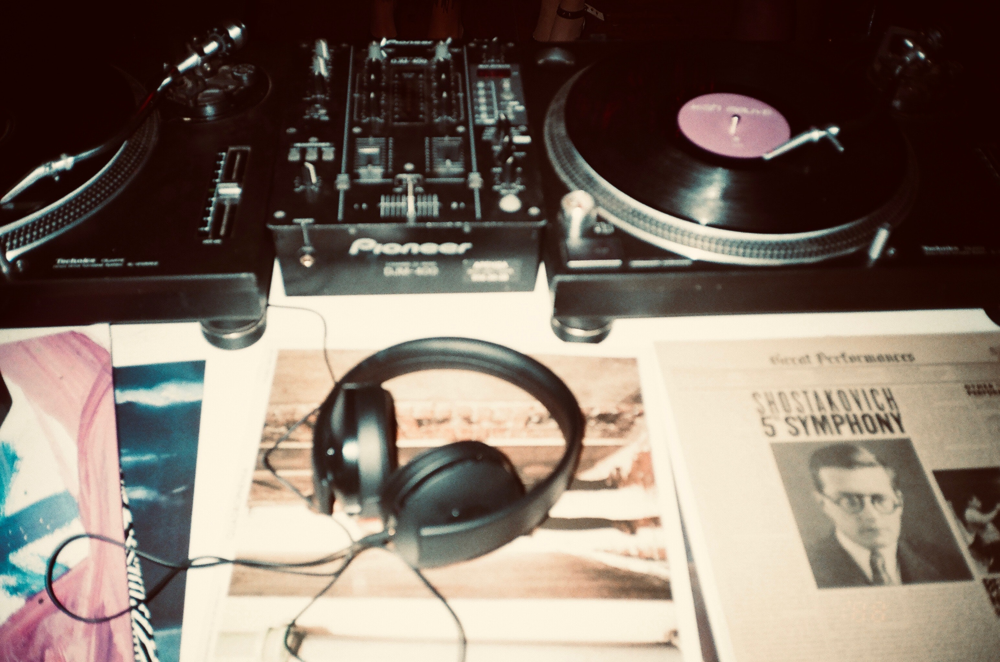

点进来的小伙伴们有眼福了，可以了解这档播客背后不为人知的故事。
（激动的搓手）

## 1. 没你不行，没你们不行

第一季最后一期《测试的价值》，凯峰老师日理万机分身乏术，我被委以重任，客串主持人。于是，这期在缺乏优秀主持人的情况下完成了录制。

来玩一个断句：质量三人行不行（好吧，这是个广告）

以前学引导的时候，看到一个理念：“具备以下两个特质的人适合做引导者：一是无法贡献内容的人，二是能忍住不贡献内容的人。” 我不以为然，怎么就不能一边引导一边贡献内容了？有机会一定要试一把，看看能不能把俩帽子戴好。

这次客串主持人的经历让我明白，如果一个人戴俩帽子，就很难有客观视角。录制过程中，平静外表下我的内心是慌乱的，扮演主持的时候老忍不住想聊内容，聊一会儿内容又忍不住想着该往回收了，下面该聊啥。结果自然是主持也演不好，内容也聊不好。

再想到平时，凯峰老师润物细无声的化解我们的尬聊，把控讨论的方向，并适时插科打诨，强大控场又不着痕迹，实属不易。术业有专攻，专业的事还是交给专业人士 @凯峰老师。

冰玉老师是我的面试官，对我有知遇之恩。她的经验之丰富、洞察之细腻，言语之间，深厚经验与体察入微互相交织，尽显温柔与专业。

与刘冉老师合作某次培训，初见似是旧时，相谈甚欢。刘老师善于思辨，常使我陷入痛并快乐的沉思。他每每打开话匣子便滔滔不绝，我都要消化好一阵子。为了自我保护，只好控制沟通频率。

偶尔乱入的网红健总就不介绍了，大家都认识。他偶尔只言片语，我脑子就要烧没。

## 2. 有人说，我们需要一个Logo

一天，凯峰老师说：“你是不是会画画？感兴趣设计个Logo？” 于是，我问心有愧的承认自己会画画（幼儿体），并承担了Logo设计的工作。以下是各个版本《质量三人行》的Logo，下排后两个是经过UX丝绒重新设计的，不得不说确实专业。大家应该只见过左下和右下，其他的被我们在过程中毙掉了，就当看个乐呵吧。

Logo的设计思路来源于圆桌，是一个大家围坐在一起畅谈的场景，考虑到3+1的人员配比，最重要的VIP核心位置当然代表凯峰老师，并给了他不同的色彩（是不是彩虹屁的有点明显）。我们在上一小节里，也论述了主持人在一场录制中的重要性，他这个位置实至名归。

后来凯峰老师觉得搞特殊不好，就跟大家对齐了颜色。（这段是我编的）

## 3. 播客有什么好听的？

最早听播客是16年，那时我在出长差，无聊又失眠的晚上没少听。

感觉播客更像是传统纸媒，不需要强互动，也没有太多传播属性，大家就一个共同话题产生点隔空的共鸣，一个很随缘的媒体形式。

听播客有点像拆盲盒，或者找Bug，并不能一上来就感知到本期的内容。随着话题的展开，逐渐拨开迷雾，渐入佳境。也许听了某个故事会感同身受，也许某句不经意的话会引起思考，也许在争论的间隙突然懂了，会心一笑。就像把一本书读薄的过程：经过一段时间的探索，打开盲盒，找到Bug，片尾音乐响起，惊喜便在眼前了。或是点滴的思绪、闪念的灵感，亦或是瞬间的感悟，不为人知，但你听见了自己。

如果《质量三人行》有一个期限的话，我希望是一百季。

_附：[质量三人行](https://qapodcast.typlog.io/)_