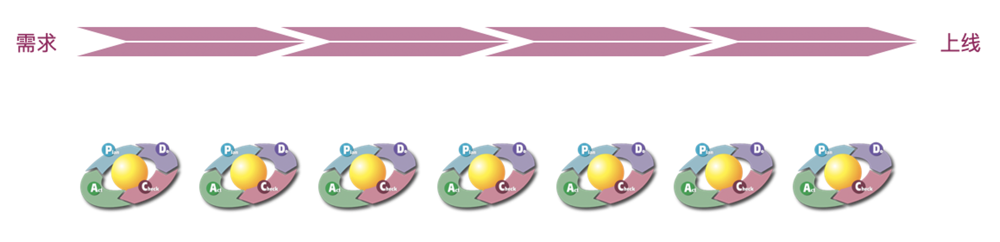

## 软件品质与上帝视角

### 软件的品质

在筹备《质量三人行》新一期的录制时，乱入的健总分享了一个很有意思的观点：“软件的品质”。后来我们展开了激烈的讨论，过程不表，先上结论：

**品质=设计+质量**

设计：包括跨产品设计一致性，用户体验、交互优化、UI…  
质量：包括功能性质量，非功能性质量（安全、性能、可用性）……

品质和质量可能不太好理解，以下有两个例句，大家体会一下其中的区别：

> 1. 这人的谈吐体现了生活品质。 <small>→ 有质量，且有精神层面的积极追求</small>
> 1. 我们要保障老年人的基本生活质量，做到老有所养。 <small>→ 质量是基线，未达基线难言其他</small>

比如我们说 iPhone 有品质，其实包含了两个方面：不但设计好，而且质量也好。锤子手机就只是设计很好，但质量参差不齐，过分追求设计细节到几近偏执，但却在手机应具备的基础功能上频频翻车。

因此，**品质是一体的，“有质无品”和“有品无质”都不能可持续工作。** 但在不同的上下文背景下，对品质的追求策略是不同的。产品型的公司会非常注重品质，用户会用脚投票，一旦品质降低就会流失用户。而在用户没有太多选择的情况下，对低品质的容忍度就会相对较高。如以下两类软件，用户的选择范围不同，对软件品质的容忍度也不同。

<small>本图仅说明用户选择范围，不代表质疑软件质量</small>

### 上帝视角

由品质的讨论，我们得出：**产品具有高品质是指产品能够恰好满足用户的需求**，大白话讲就是用户用着爽。用户无所谓体验设计、可用性、兼容性这些概念，也无所谓研发内部是如何分工协作的……不管是设计缺陷，还是出Bug了，用户都会觉得用着不爽。

而角色的分工、各角色工件的质量、过程管理和优化……这些都是“支撑性需求”，用户可能并不实际感知，但却对软件外在品质的表现起着重要作用。因此为了提升品质的外在表现，研发内部的提升也是很重要的。

**品质决定价值，价值影响品质**，两者是“鸡与蛋”的关系，相生相克，相爱相杀。我们做软件，本质是做服务，toC 就是服务于全网用户，toB 就是服务于企业。服务行业讲究“顾客就是上帝”，用户/客户就是软件从业者的“上帝”，谁拥有了用户视角，也就更容易在激烈竞争中立于不败之地。

## 分工？术业有专攻

想到最近关于QA转角色的讨论，以及去测试化的持续热议，不由得引起我对分工这个话题的兴趣。

<small>截图来自动画短片《雇佣人生》</small>

### 分工是怎么来的

先来看看分工是什么：

- 分工是指各种社会劳动力的划分与独立化。（基本解释）
- 分工是指按不同技能或社会要求分别做各不相同而又互相补充的工作。（引申含义）

再来看看分工的目的：

- 提升品质：随着熟练度的增加，产量和品质都会有所提升。
- 提高效率：
  - 如果没有分工，工序的转换会损失时间，分工则避免了工序切换的时间损失
  - 随着对工序的理解加深，可以发明更有效率的机械和工具，以提高产量

由此我们大致可以得出：**分工是为了提升品质和效率，而让拥有不同技能的人分别从事各种不同而又互相联系的工作。**

### 术业有专攻

**分工是在一定条件下产生的，而当这个条件发生变化时，分工的演变是必然的结果。**

以前没有软件缺陷的概念，当那只蛾子飞进电脑，第一个Bug产生了。以前也没有软件测试，当人们发现找Bug这件事需要专业技能时，软件测试行业就诞生了，开发和测试的分工也就因此产生。

<small>1947年9月9日，葛丽丝·霍普（Grace Hopper）发现了第一个电脑上的bug，一只飞蛾意外飞入了一台电脑内部而引起的故障（如图所示）。  —— 维基百科</small>

在研发体系中，体验设计师、产品经理、开发、测试、项目管理，这些角色的划分完美的满足了分工的定义，这些角色既需要拥有不同的技能，又分别从事着侧重点不同的工作，而他们的工作又有着紧密的联系（都是为了交付最终产品）。

- 产品经理/需求分析师：挖掘痛点、定义问题，将用户需求翻译成产品需求
- 体验设计师：产品的体验设计和交互设计，品质中“品”的体现
- 开发：软件设计与实现
- 测试（狭义的）：软件质量的保障，品质中“质”的体现
- 项目经理：团队和外部、团队内各角色之间的枢纽，确保软件如期的交付

**只有这些角色各司其职，又紧密合作，才能达成最终的目标，让用户用着爽。**

### 认识你自己

我在上面提到测试角色时用了“狭义的”字眼，这是因为“测试”相关的工作可以有多种不同的释义：

- 测试：设计并执行测试用例
- 测试开发：以自动化的方式设计和执行测试，工作内容既有测试又有开发
- 质量保障/质量分析：事前干预、过程中分析和事后改进，关注质量产生的过程和结果
- 质量经理/总监：管理质量和质量相关资源（人和物）
- 不同质量领域的测试：性能测试、安全测试、Web/无线测试
- 不同业务领域的测试：大数据测试、AI测试、测试运维

看上去挺多，抽象一下就两类：

- 质检员：工作模式都是事后验证，输入（软件/用例/数据）→判断→输出（通过/不通过），工作目标是确保生产出来的软件质量没问题
- QA：能对质量进行事前干预，没有固定的工作模式，工作目标是确保能生产出满足品质需求的软件

<small>质检员的工作模式</small>

    
我们看回分工的第二个目的——提高效率，“随着对工序的理解加深，可以发明更有效率的机械和工具，以提高产量”，这就是说，质检员是可以被自动化机械和工具所取代的。这并不是说手工测试可以被自动化测试取代，而是说手工测试中的那些大量重复的回归用例可以被自动化所取代。

基于以上的讨论，我们来看一下第一个测试常见问题：**手工测试有没有出路？** 如果是大量重复的执行测试用例，没有出路，完全可以被自动化测试所取代；如果能设计出非常精准的测试用例集，在发现大量缺陷的同时又不造成资源浪费，又或者是精通不可回归的探索式测试，把测试人员的主观能动性发挥到极致，那么这样的测试哪怕不写代码，也是有核心竞争力的，不愁没出路。

再来看一下第二个测试常见问题：**测试人员要不要写代码？** 要不要写看个人兴趣，但基本的代码能力是必需的。否则无法对软件设计中的潜在问题有所察觉，无法提前预防缺陷产生，更无法跟开发高效的沟通和交流。如果对技术有兴趣，想做自动化或写测试平台，那肯定要大量写代码。如果对技术不感兴趣，写不写无所谓，不用看别人写我也要写。

**持续精进的第一步，认识你是谁。** 我现在所做的“QA”到底是质检员还是真QA呢？我是对技术有热情还是对管理有兴趣？亦或是对某一特定领域感兴趣？我对质量工作真的有热情吗？我愿意致力于打造质量文化吗？

### 忘了你是谁

再进一步，测试要想发展好，必须由质检员转向QA（能对质量进行事前干预，没有固定的工作模式，工作目标是确保能生产出满足品质需求的软件）。**必须忘了你是谁，就像演员一样演谁是谁。** 不用受困于角色分工，找到自己真正想做的事情，戴什么帽子无所谓，只要还在致力于打造质量文化，谁又能说你不是个QA呢？

之前跟其他角色伙伴请教问题，大家好奇我为什么想知道这些，我总是调侃：“为了生存，测试手伸不长，活不了啊~” 软件行业整体对测试要求真的是越来越高了，测试左移、测试右移、质量管理、测试运维……测试就像个筐，啥都往里装。调侃归调侃，多了解点总归没坏处，咱进可攻退可守啊，想尝试其他角色也方便点儿不是。

## QA永存

去测试化不会成为现实，“能够测试”并不代表：

- 能够做好测试
- 质量有所提升
- 整体品质有所提升
- 软件表现与品质需求一致
- 用户一定买单
- 团队合作顺畅
- 投入和产出比理想
- 平稳应对大环境变化
- 良好适应品位逐渐上升的用户
- ……

本文说了这么多，就是想回答一下那些经久不衰的问题：

1. 测试能被取代么？<small>质检员类的测试能被取代，QA不能。</small>
1. 测试要写代码么？<small>最好有一定的理解，写不写看兴趣。</small>
1. 测试要转角色吗？<small>都行，看个人选择，犹豫最浪费时间。</small>
1. 测试会不会被优化、被淘汰？<small>有可能，得看个人是不是容易被取代。</small>
1. 测试没有价值感怎么办？<small>人生本身也没什么意义，活着活着就有意义了。要为自己找到意义呀~</small>

不知道表达是否清楚，我想说：质量话题涉及太广，除非用户不再追求品质，企业不再追求降本增效，或者AI可以完全取代人类……否则QA将永存。也许在行业演进过程中，或者个人职业生涯发展中，角色名称、工作形态会发生变化，但QA内核将永存。

<small>图片来源：quotefancy</small>

_【参考阅读】：_

1.  [<small>维基百科：分工</small>](https://zh.wikipedia.org/wiki/%E5%88%86%E5%B7%A5)
1. [<small>《软件测试人员的机遇与挑战》</small>](https://www.bylinzi.com/2019/06/05/software-testers-challenge-n-chance/)
1. [<small>《软件测试人员的职业发展之路》</small>](https://www.bylinzi.com/2020/03/13/software-tester-career-path/)
1. [<small>《测试人员价值的终极体现》</small>](https://insights.thoughtworks.cn/qa-value/)
1. <small>《像用户一样测试》系列的前三篇：</small>[<small>打破知识诅咒</small>](https://qualityfocus.club/test-as-user)、[<small>不妨犯傻</small>](https://qualityfocus.club/fool-proof)、[<small>别掉链子</small>](https://qualityfocus.club/drop-chain)
